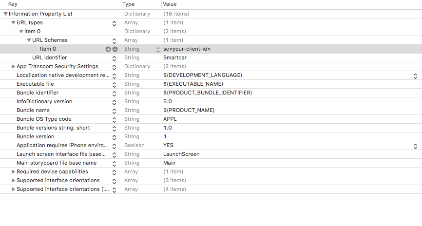

This is the starter kit for iOS SDK with Swift.

This kit contains a simple iOS application that displays car information using Smartcar's iOS SDK and Swift.

## Instructions
Before we get started, create an application on Smartcar's Developer Dashboard to get your API keys.

**Note:** On the dashboard, you will want to set your `redirect_uri` as `'sc' + clientId + '://exchange'`.

Then, we can set these constants in `Constants.swift` -
```swift
struct Constants {
    static let clientId = "<your-client-id>";
}
```

Next, we need to setup the custom URL scheme in the `Info.plist` -



Before setting up the client code, make sure to set up the server code. You can use any of our following back-end SDKs -
* [Node SDK](https://github.com/smartcar/getting-started-node-sdk)
* [Python SDK](https://github.com/smartcar/getting-started-python-sdk)
* [Java SDK](https://github.com/smartcar/getting-started-java-sdk)

Follow the setup instructions in the back-end README except for the `redirect_uri`. Make sure the `redirect_uri` environment variable in the back-end directory is the same as the one we have set above.

Now that the server is ready, you can set up the client (the React application).

Set the server `uri` in `Constants.swift`. This should be from your back-end directory and is set to `http://localhost:8000` by default.
```swift
static let appServer = "<app-server>"
```
Make sure you have cloned this repo -
```bash
$ git clone git@github.com:smartcar/getting-started-ios-sdk.git
$ cd getting-started-ios-sdk/app
```
To install the required dependencies -
```bash
$ pod install
```

Launch the `getting-started-ios-sdk.cxworkspace` and run the iOS simulator within XCode! In our current set up, we are using Smartcar's [test mode](https://smartcar.com/docs/guides/testing/), so you can log in with any username and password and you will see information of a simulated vehicle.
